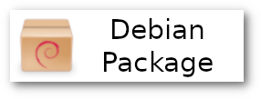
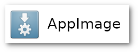

    
## App Outlet  | [](https://travis-ci.org/app-outlet/app-outlet)

App Outlet is a Universal application store inspired on the Linux App Store online service. It easily allows you to search and download [W.I.P] applications that runs on most Linux distributions. It currently works with AppImages, Flatpaks and Snaps.


### Download

You can get App Outlet by clicking on the following options:

[](https://appoutlet.herokuapp.com/download/deb)
[](https://appoutlet.herokuapp.com/download/appimage)
[](https://snapcraft.io/app-outlet)

You can also get the unpacked version here:

[](https://appoutlet.herokuapp.com/download/unpacked)

If your distro doesn't support the available packages you can dowload and compile the source code following the instructions below. 

## Runing and building the app
You can run or build App Outlet by yourself. You can build in Linux, Windows or Mac OS but the software install features will work only in linux systems. 

### Setting up the project
#### Step 1: Installing system dependencies
You will need the following tools:
- [Git](https://git-scm.com/) (Version: 2.23.0 or above)
- [NodeJS](https://nodejs.org/) (Version: 10.16.3 or above)

#### Step 2: Clone the repository
```
git clone https://github.com/app-outlet/app-outlet.git
cd app-outlet
```

#### Step 3: Installing the project dependecies
```
npm install
```

### Running the app

```
npm run start
```

### Building the app
#### To build for linux run:
```
npm run electron:linux
```
This command will generate:
- An AppImage file 
- An .deb file
- An .snap file
- A folder `linux-unpacked` folder with the unpacked app

***PS: In the future we also will have a Flatpak version***

***PPS: You can run/build for Windows or MacOS too. But the installing app features will probably not work***

## Third part stuff:
- Icon made by [martz90](https://www.deviantart.com/martz90) from [deviantart.com](https://www.deviantart.com/martz90/art/Light-Icons-Pack-379943080)
- Initial project started using [angular-electron boilerplate](https://github.com/maximegris/angular-electron)

