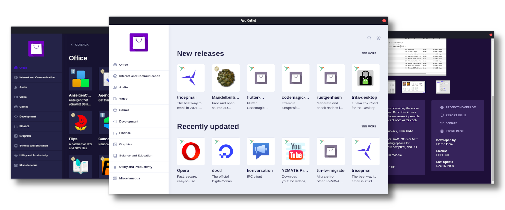

    
    <h1>App Outlet</h1>
    
    
    
    
    
    <h1></h1>
     

App Outlet is a Universal application store. It easily allows you to search and download applications that runs on most
Linux distributions. It currently supports AppImages, Flatpaks and Snaps packages.

## [Click here to Download](https://www.pling.com/p/1355468/#files-panel)
Or [here](https://github.com/app-outlet/app-outlet/releases) to the Github releases

If your distro doesn't support the available packages you can download and compile the source code following the instructions [here](CONTRIBUTING.md).

## Who is talking about us?

- [Diolinux (in portuguese)](https://www.diolinux.com.br/2019/10/app-outlet-o-sucessor-do-linux-app-store-loja-snap-appimage-flatpak.html)
- [OMGUbuntu (in english)](https://www.omgubuntu.co.uk/2019/10/app-outlet-universal-linux-app-store)
- [Le store Linux App Outlet pour paquets universels (in french)](https://www.youtube.com/watch?v=0JGLPieBSN0)
- [edivaldobrito (in portuguese)](https://www.edivaldobrito.com.br/como-instalar-a-linux-app-store-app-outlet-no-linux/)
- [funkyspacemonkey (in english)](https://www.funkyspacemonkey.com/app-outlet-a-universal-linux-app-store)
